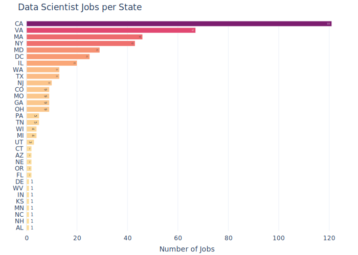
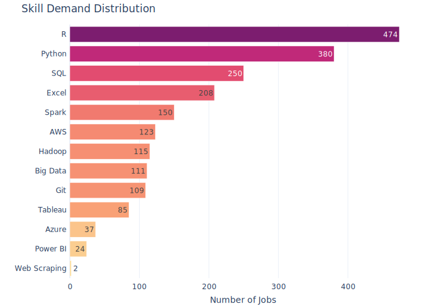
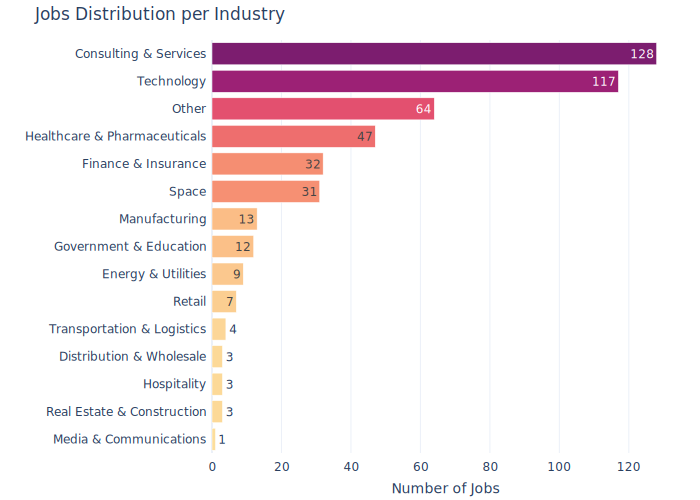
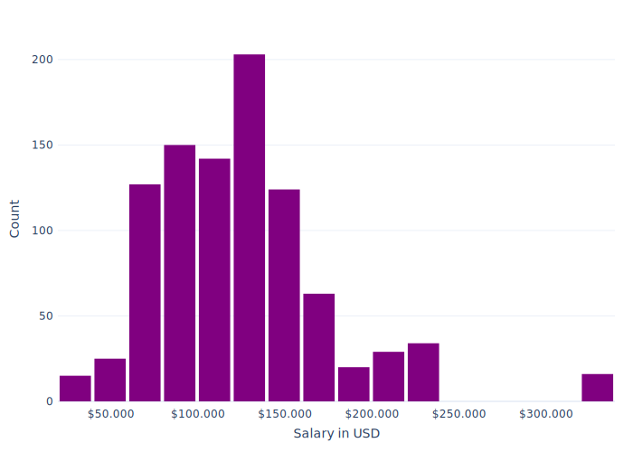

# Data Science Job Market Analysis (Glassdoor)

## Overview
This project aims to analyze the data science job market in the USA using a dataset of job listings from Glassdoor. The project is divided into two main parts: data cleaning and transformation, and data visualization and analysis. The goal is to identify key trends in the job market, including geographic distribution, skill demand, industry distribution, and salary expectations.

## Project Structure
1. **Data Cleaning and Transformation**
2. **Data Visualization and Analysis**

## Part 1: Data Cleaning and Transformation

### Summary
In this part, the dataset was cleaned and transformed to prepare it for analysis. The dataset consists of 672 data science job listings, and the following steps were taken:

- Removed duplicate entries and irrelevant columns.
- Handled missing values by using appropriate imputation techniques.
- Standardized the format of various fields, such as job titles and company names.
- Extracted relevant information from the job descriptions, such as required skills.

### Tools and Libraries Used
- Python
- Pandas
- NumPy

### Key Steps
- **Data Cleaning**: Ensured the data is free of errors, inconsistencies, and missing values.
- **Data Transformation**: Standardized and formatted data for analysis.

## Part 2: Data Visualization and Analysis

### Summary
This part involves the creation of visualizations to gain insights from the cleaned dataset. Key trends and patterns in the job market were identified, focusing on geographic distribution, skill demand, industry distribution, and salary expectations.

### Tools and Libraries Used
- Python
- Matplotlib
- WordCloud
- Plotly

### Key Insights

#### Geographic Distribution
- **Top States**: California leads in job offers, followed by Virginia, Massachusetts, New York, and Maryland. The majority of job opportunities are concentrated in these five states.

#### Skill Demand
- **Top Skills**: The most highly demanded skills in the market are R, Python, and SQL. Possessing these skills will significantly enhance a candidate's chances of getting job interviews and securing positions in the field.

#### Industry Distribution
- **Leading Industries**: Most job offers are in the Consulting & Services and Technology sectors. Additionally, there are significant job offers in an unspecified industry (Other).
- **Other Notable Industries**: Industries with considerable job offers include Healthcare & Pharmaceuticals, Finance & Insurance, and Space.

#### Salary Distribution
- **Common Salary Range**: The majority of job postings offer salaries between $75K and $150K, indicating this range is typical for many positions and deemed appropriate by many employers.
- **High Salary Range**: Jobs with salaries above $180K are less common, suggesting that these roles likely require specialized skills or higher levels of experience.
- **Entry-Level Salary Range**: Jobs with salaries below $70K are fewer and could represent entry-level positions or roles in industries or regions with lower pay scales.

### Recommendations

- **Targeting High-Opportunity Locations**: Focus job search efforts in the top five states (California, Virginia, Massachusetts, New York, Maryland) where job opportunities are abundant.
- **Skill Development**: Prioritize acquiring and mastering the top skills (R, Python, SQL) to increase employability and competitiveness in the job market.
- **Industry Focus**: Consider targeting job opportunities in the leading industries (Consulting & Services, Technology) and also explore significant opportunities in Healthcare & Pharmaceuticals, Finance & Insurance, and Space.
- **Salary Expectations**: Align salary expectations with the common range of $75K to $150K. For higher compensation, aim to develop specialized skills and gain experience to qualify for roles offering above $180K. For entry-level positions, expect salaries below $70K, which provide a starting point for gaining experience and advancing in the field.

## Conclusion
The analysis of data science job postings in the USA reveals crucial trends and provides actionable recommendations for aspiring data scientists. By focusing on high-opportunity locations, developing in-demand skills, targeting key industries, and aligning salary expectations, candidates can enhance their chances of success in the data science job market.

## Acknowledgements
Special thanks to the contributor on [Kaggle](https://www.kaggle.com/) who provided the dataset sourced from Glassdoor. Additionally, gratitude to the developers of the libraries and tools used in this project.

## Contact
For any inquiries or further information, please contact me at 
.

---

*This project was completed as a personal endeavor to understand the data science job market and improve data analysis and visualization skills.*
